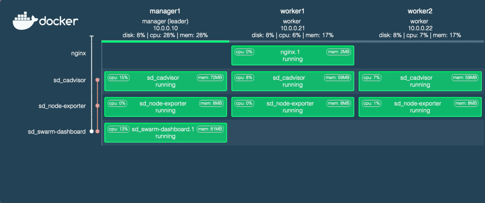

# Swarm Dashboard

A simple monitoring dashboard for Docker in Swarm Mode.



## About

Swarm dashboard shows you all the tasks running on a Docker Swarm organised
by service and node. It provides a visualisation that's space efficient
and works well at a glance.

You can use it as a simple live dashboard of the state of your Swarm.

The Dashboard has a node.js server which streams swarm updates to an Elm client
over a websocket.

### Prior art

* Heavily inspired by [Docker Swarm Visualiser](https://github.com/dockersamples/docker-swarm-visualizer)

## Running

At the moment, the dashboard needs to be deployed on one of the swarm managers.
You can configure it with the following Docker compose file:

```yml
# compose.yml
version: "3"

services:
  dashboard:
    image: mohsenasm/swarm-dashboard
    volumes:
      - "/var/run/docker.sock:/var/run/docker.sock"
      - lego-files:/lego-files
    ports:
      - 8081:8081
    environment:
      PORT: 8081
      ENABLE_AUTHENTICATION: "false"
      # ENABLE_AUTHENTICATION: "true"
      # AUTHENTICATION_REALM: "KuW2i9GdLIkql"
      # USERNAME: "admin"
      # PASSWORD: "supersecret"
      ENABLE_HTTPS: "false"
      # ENABLE_HTTPS: "true"
      # HTTPS_HOSTNAME: "example.com"
      # LEGO_NEW_COMMAND_ARGS: "--accept-tos --email=you@example.com --domains=example.com --dns cloudflare run"
      # LEGO_RENEW_COMMAND_ARGS: "--accept-tos --email=you@example.com --domains=example.com --dns cloudflare renew"
      # CLOUDFLARE_EMAIL: "you@example.com"
      # CLOUDFLARE_API_KEY: "yourprivatecloudflareapikey"
    deploy:
      replicas: 1
      placement:
        constraints:
          - node.role == manager

volumes:
  lego-files:
```

and deploy with

```
$ docker stack deploy -c compose.yml svc
```

## Security

In this fork we have added some security measures:

+ We don't send the whole docker event data. The [main repo](https://github.com/charypar/swarm-dashboard) sends everything, including environment variables (someone might have stored some passwords in them, by mistake!).

+ Using the `ENABLE_AUTHENTICATION` environment variable, there is an option to use `Basic Auth`. The WebSocket server will close the connection if it does not receive a valid authentication token.

+ Using the `ENABLE_HTTPS` environment variable, there is an option to use `HTTPS` and `WSS`. We have Let’s Encrypt integration with the DNS challenge.


## Production use

There are two considerations for any serious deployment of the dashboard:

1. Security - the dashboard node.js server has access to the docker daemon unix socket
   and runs on the manager, which makes it a significant attack surface (i.e. compromising
   the dashboard's node server would give an attacker full control of the swarm)
1. The interaction with docker API is a fairly rough implementation and
   is not very optimised. The server polls the API every 500 ms, publishing the
   response data to all open websockets if it changed since last time. There
   is probably a better way to look for changes in the Swarm that could be used
   in the future.


## Rough roadmap

* Show more service details (published port, image name and version)
* Node / Service / Task details panel
* Show node / task resources (CPU & Memory)
* Improve security for potential production use

Both feature requests and pull requests are welcome

## Contributors

* Viktor Charypar (owner, BDFL) - code, docs
* Clementine Brown - design
